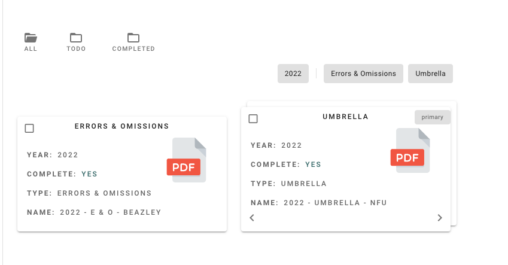
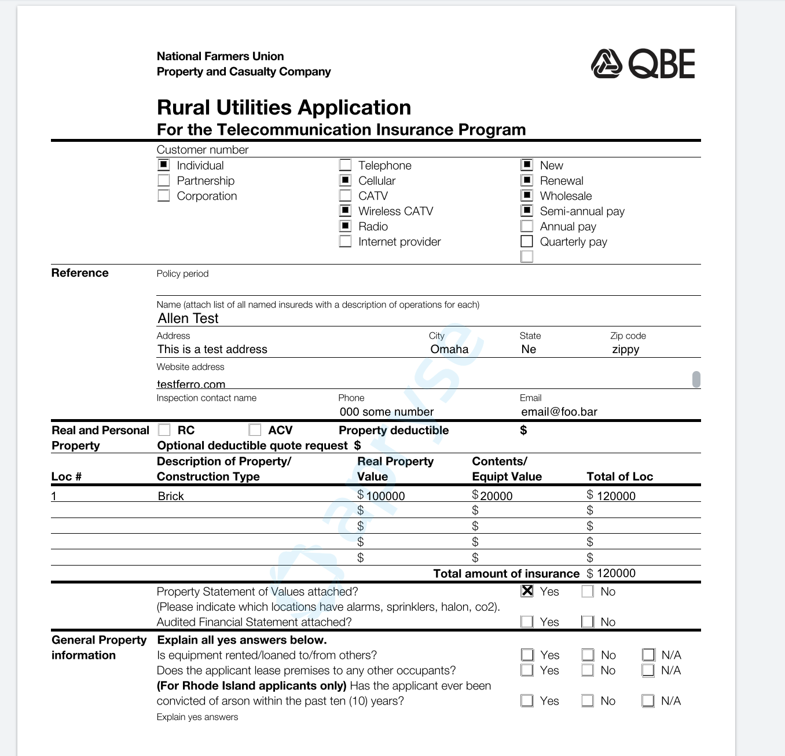
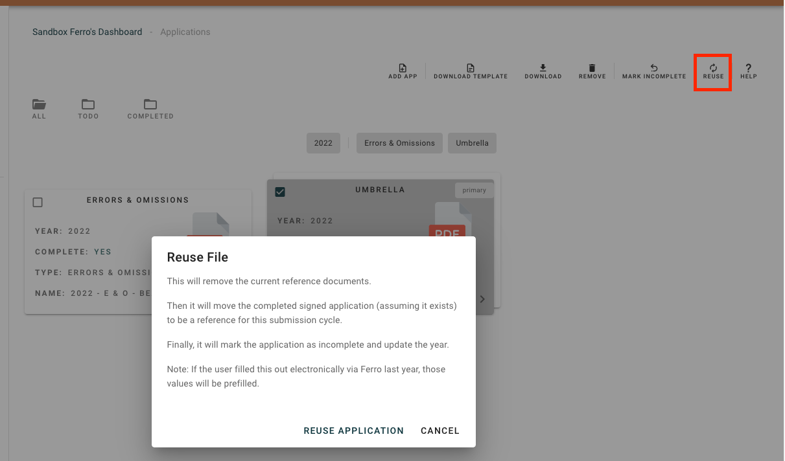
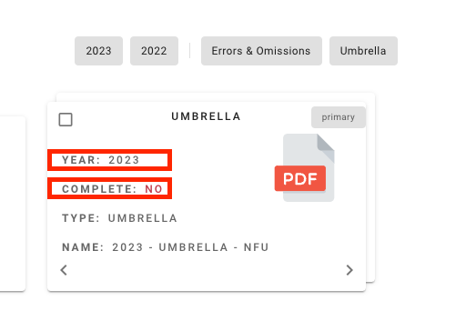

# Renewing Applications

## State of the Union from 2022

Suppose it's 2023 and its renewal season. Here's the state of the application from last year:

There are 2 completed applications. (And 0 applicaiton to do.)

Let's open one up.

You can see that it was completed digitally inside of Ferro.

## Set up 2023 Renewal

### Reuse exact same application

When it is time for 2023 renewal, if we want to fill out the exact same application as last year, then we have a great feature. The `REUSE` button.

The `REUSE` button will: 

1. Replace the reference documents from 2021 with the completed application from 2022.
1. Set up the application for 2023 and mark it as to do / incomplete
1. Finally - if the application was filled out electionically in Ferro, it will copy over the data so that the insured can start from where they left off in 2022.

