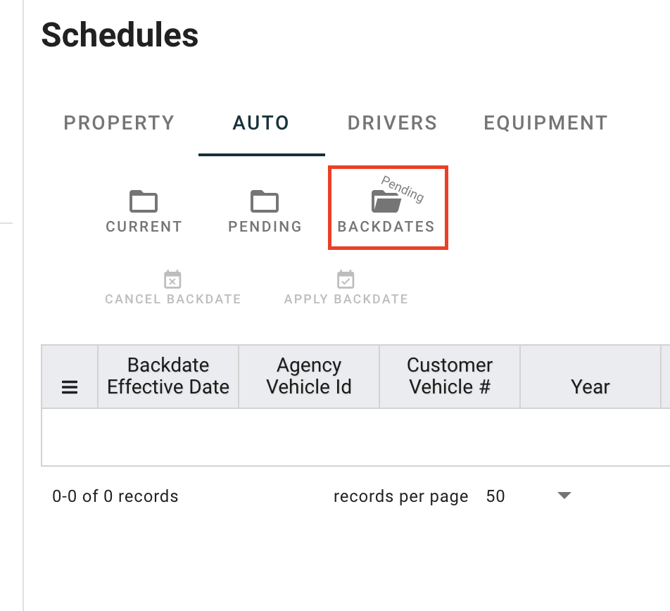
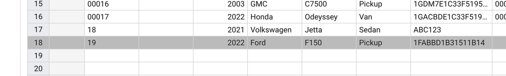
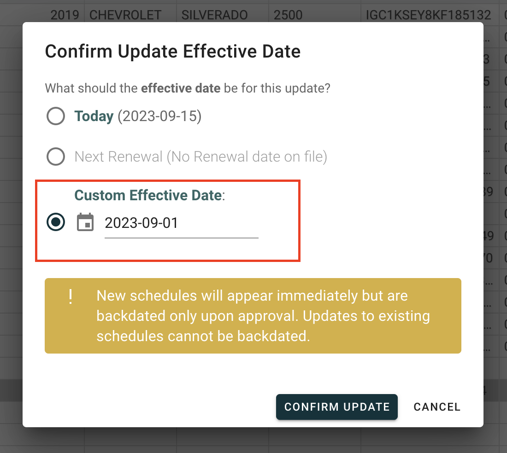
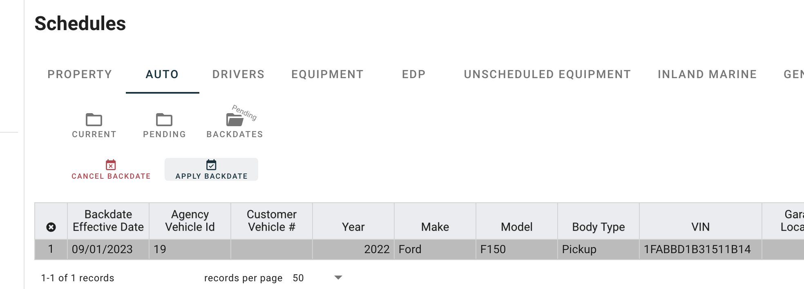

# Backdated Schedules

This will demo the Ferro backdate approval flow.

A backdate is useful when you want to add a record to the schedule, with an effective date in the past. This will impact the schedules in the snapshot view.

The brokerage team is given the opportunity to approve the backdate, or cancel the backdate. Either way, the record will be on the current schedule.

### Add a new backdated record

Enter the information for the new schedule item.

Click Save.

### Select a backdated effective date

Notice the custom effective date is before today (which is 9/15)

### Approve

Saving will immedately add the schedule item to the schedule. It will also send a notification to the brokerage that a record is pending a backdate. You can approve or cancel the backdating process via the `Pending Backdates` folder section.

