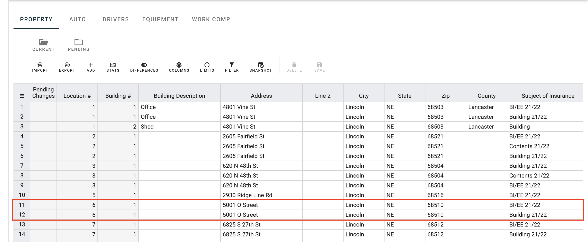
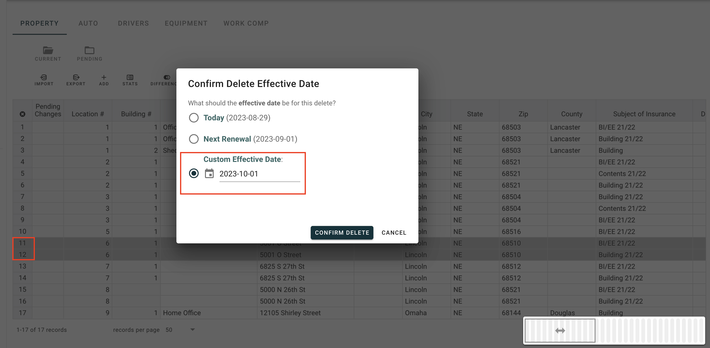
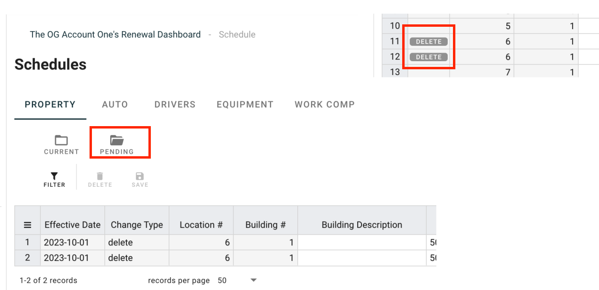

# Pending Schedules

As you know, Ferro can keep your schedules organized, in a living document, accessible anywhere and to everyone. Whenver your company has a change, you can easily go into Ferro and update the schedule. This way the insured, broker, and possibly other parties are all working from the same place, ensuring no one is out of date. 

Now - there are also times when you know your schedule is going to change. Perhaps you have a property sale pending, that will be executed at the first of the next month.  While the sale is on your mind, you can enter that information into Ferro today.  This is where **Pending Schedules** can help.

If you are interested in this feature, please contact Ferro and we can work with you.

## Enter future dated schedules changes

In this section, we will demonstrate how to remove a property at a future date. 

1. Open Ferro to the property schedule
1. While in the current view, find or search for the property record you want to remove from the schedule.

   1. In this case, we will be removing location 6 (building 1)

1. Highlight the rows (click on the row numbers - hold control or shift as necessary)), and click the delete button on the schedule toolbar.

1. In the confirmation dialog, select the "Custom Effective Date" option, and put in the date that the property will be sold. (In this case, the property will be sold on October 1st).

1. Confirm the change
1. On the Current view, you will see a "DELETE" indicator on the records, in the "Pending Changes" column.
1. In the "Pending" view, you will see a complete list of the updates that will be applied in the future.

1. Ferro will take it from here, On October 1st (Around noon), this change will be automatically applied to schedule. If the schedule changes noticiations are turned on for your account, the normal changes email will be sent out to the brokerage team. 