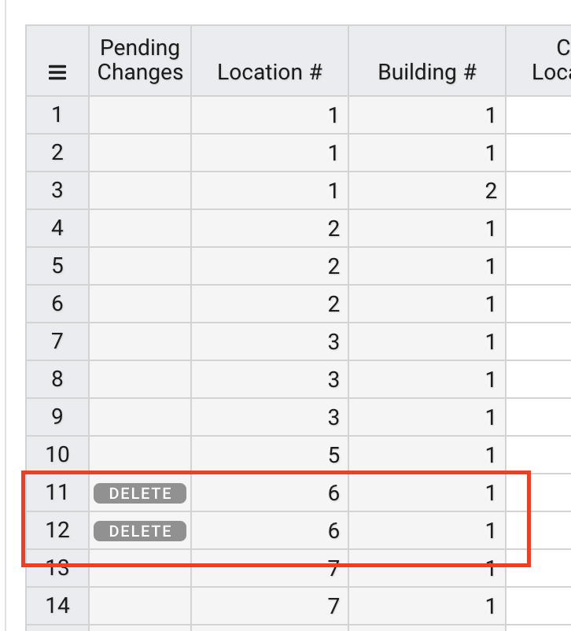
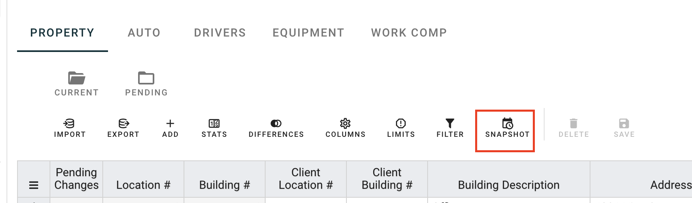
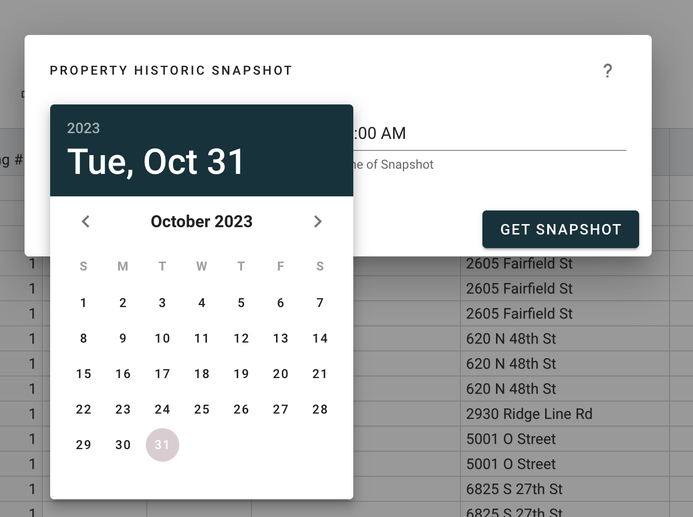
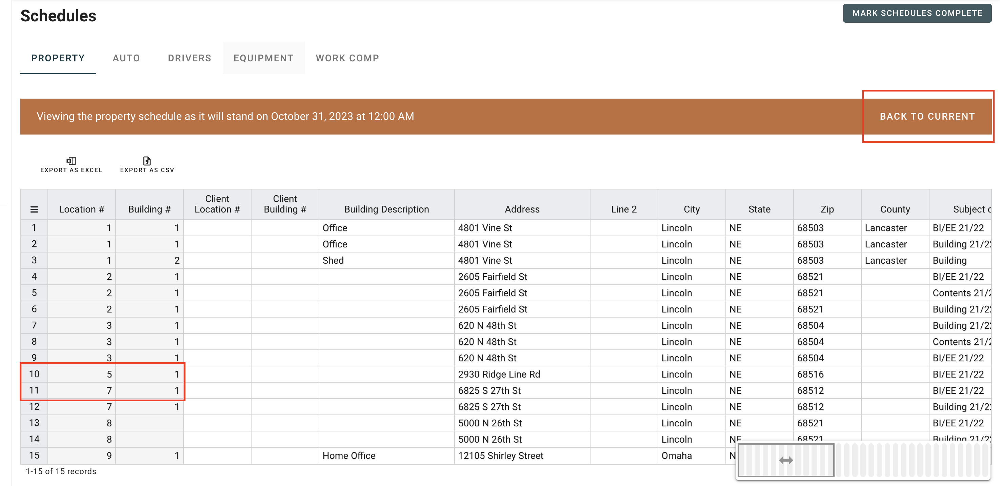

# Snapshot View
What did this schedule look like three months ago? 

What will this schedule look like in two months (with my Pending Changes applied)?

Both of these questions can be answered with the Schedule Snapshot View in Ferro.

## Demo
In this demo, we have a pending change - a future delete - on Location 6, building 1. This change is set for October 1st.

How will our schedule look after the delete?

1. Click the snapshot button

1. Select a date (and time, if relevant)

1. View the schedule as it stood, or as it will stand with pending changes applied

